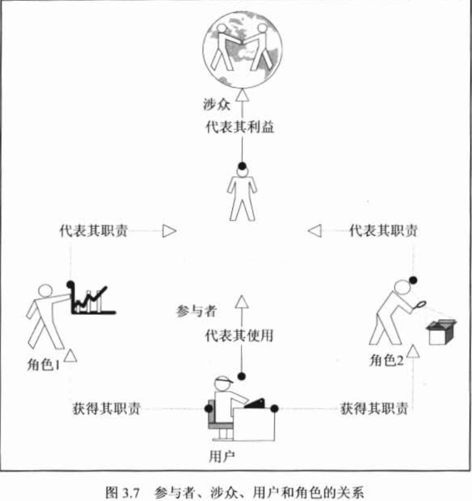
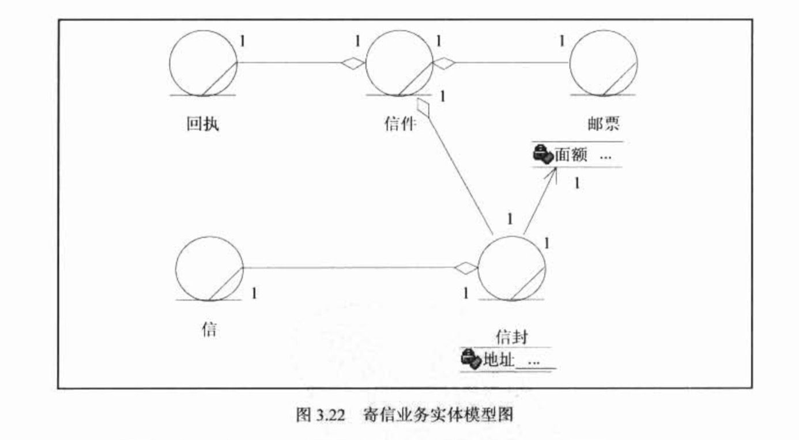

# Think in UML 总结
===
**前言: 第二部分基础篇**

## UML 核心元素

### 1 版型
> 这个概念是对一个 UML 元素基础定义的扩展,在同一个元素基础定义的上赋予特别的含义

### 2 参与者
>**引言: 建模是从寻找抽象角度开始的，那么定义人，准确地说是定义参与者，就是我们寻找抽象角度的开始**

#### 2.1 基本概念
>参与者(actor)，实在系统之外与系统交互的某人或某事物
**重点: 参与者和系统之间一定是有边界的存在的**

##### 2.1.1 参与者位于边界之外

* 如何去定系统之外和系统之内呢?
    * 谁对系统有着明确的目标和要求并且主动发出动作
    * 系统是为谁服务的

##### 2.1.2 参与者可以非人

> 任何需求都必须至少有一个启动者，如果找不到启动者，这一定不是功能性需求

#### 2.2 发现参与者
> 一个重要来源是涉众，从涉众中找出那些直接对系统发出动作，或
直接从系统中接受反馈的涉众
* 使用以下问题发现参与者
    * 谁负责提供、使用或删除信息
    * 谁将使用此功能
    * 谁对某个特定功能感兴趣
    * 在组织中的什么地方使用系统
    * 谁负责支持和维护系统
    * 系统有哪些外部资源
    * 其他还有哪些系统将需要与该系统进行交互

#### 2.3 业务主角
> 业务主角(business actor)是参与则的一个版型，特别用于
定义业务的参与者，在需求阶段使用，业务主角是与业务系统有着
交互的人和事物，它们用来确定业务范围(见注),遵守参与者的所有定义
 
> 注: 业务范围和系统范围是不同的，业务范围指这个项目所涉及的所有客户业务，
这些业务有没有计算机系统参与都客观存在，而系统返回则是指软件将要
实现的那些对应于业务功能系统功能，从功能性需求来说系统范围是业务返回的一个子集
但是一些系统功能会超出业务范围，例如操作日志，有没有操作日志
并不影响业务目标的达成，客户也不一定要提出这个要求，但是从系统角度触发，操作日志会使得系统更加健壮

* 查找业务主角必须抛开计算机
* 如果你不自信找到的业务主角,回答以下问题
    * 业务主角的名称是否是客户的业务术语
    * 业务主角的职责是否在客户的岗位手册里有对应的定义
    * 业务主角的业务用例是否否是客户的业务术语
    * 客户是否对业务主角能顺利理解

#### 2.4 业务工人

> 参与者处于边界之内，虽然参与了业务的执行过程，这应当称之为业务工人
* 区分参与者还是业务工人?
    * 他是主动向系统发出动作的吗
    * 他有完整的业务目标吗
    * 系统是为他服务的吗

### 2.5 参与者与涉众的关系

> 涉众(stakeholder),干系人,只要和这个系统有利益关系的都是这个项目的涉众  
> 参与者是涉众的代表,并非所有的涉众都是参与者

#### 2.6 参与者与用户的关系

> 用户(user)是指系统的使用者，就是系统的操作员，是参与者的代表
，或者说是参与者的实例，代表一部分的参与者,并非所有的参与者都是用户

> 由于一个用户可以代理多个参与者，因此一个用户可以拥有多个职责，
也就是可以被指定多个角色

#### 2.7 参与者与角色的关系

> 角色(role)是参与者的职责，角色是一个抽象的概念，从众多参与者的职责中
抽象出相同的那一部分，将其命名形成一个角色，一般适用于概念阶段的模型里
以代表业务的逻辑理解

#### 2.8 参与者的核心地位

> 从上面的描述我们可以知道，参与者是涉众的代表，它代表涉众
对系统的利益要求，并向系统提出建设要求,参与者通过代理给其他用户
或将自身实例化成用户来使用系统,参与者的职责可以用角色来归纳，
用户被指定扮演那个或那些角色因此来获得参与者的职责

### 3. 用例

#### 3.1 基本概念
> 定义:用例定义了一组用例实例，其中每个实例都是系统所执行的一些列操作
，这些操作生成特定主角可以观测的值

> 或者说:一个用例就是参与者(actor)交互的，并且给参与者提供可观测的有意义
的结果的一系列活动的集合

> 所谓的用例，就是一件事情， 要完成这件事情，需要做一系列的活动;而做一件事情可以有很多不同的办法
和步骤， 也可能会遇到各种各样的意外情况，因此这件事情是由很多不同情况的集合构成的

> 一个场景就是就是一个用例的实例

* 一个完整的用例组成为
    * 参与者
    * 前置条件
    * 场景
    * 后置条件
> 例子: 你想做一顿饭吃，需要完成煮饭和炒菜两个事情，这两件事情
就是两个用例，而煮饭这个事情可以有不同的做法，可以用电饭锅，可以用蒸笼
，这就是两种不同的场景,也就是两个实例
同样是电饭锅做，如果是糙米，你需要淘米，再下锅；如果是精米。可以省掉
淘米直接下锅，这就是用例在不同条件下的不同处理场景
，要启动用例是有条件的，要做饭，首先得要有米,这就是前置条件，用例执行完了，会有一个结果，米变成了饭，这称为后置条件

#### 3.2 用例的特征

* 用例是相对独立的
> 不能完整达到参与者愿望的不能称为用例
* 用例的执行结果对参与者来说是可观测的和有意义的
* 这件事必须由一个参与者发起。不存在没有参与者的用例，用例不应该自动启动，也不应该主动启动另一个用例
* 用例必然是以动宾短语形式出现的
> 用例必须有一个动作和动作的受体
* 一个用例就是一个需求单元、分析单元、设计单元、开发单元、测试单元、甚至部署单元

#### 3.3 用例的粒度
> 概念建模阶段，用例的粒度以每个用例能描述一个完整的事件流为宜

> 最标准的方法是以该用例是否完成了参与则的某个完整目的为依据

> 粒度如何选择，必须把握的原则是在同一个需求阶段，所有用例的粒度应该
是同一个量级的

#### 3.4 用例的获得

* 为找到用例，我们需要对主角(参与者/业务代表)引导询问以下问题
    * 您对系统有什么期望
    * 您打算在这个系统里做些什么事情
    * 您做这件事的目的是什么
    * 您做完这件事情希望有一个什么样的结果
* 接着需要在概念模型中提取公共的业务单元，总之，你需要确保:
    * 一个明确的有效的目标才是一个用例的获取
    * 一个真实的目标应当完备地表达主角的期望
    * 一个有效的目标应当在系统边界内，由主角发动，并具有明确的后果

#### 3.5 用例和功能的误区

> 用例不是功能,功能描述的是 输入->计算->输出,是用来描述计算机的
而非定义需求的术语

* 描述事物的时候，从以下三个观点出发：
    * 这个事物是什么
    * 这个事物能做什么
    * 人们能够用这个事物做什么

* 功能和用例的总结:
    * 功能是脱离使用者的愿望而存在的
    * 功能是孤立的,给一个输入，通过计算就有一个固定的输出
    * 用例是系统性的，它需要描述谁在什么情况下，通过什么方式。结果是什么
    * 用例可以解释为一系列完成一个特定目标的 "功能" 的组合
>  eg: 从功能的角度出发，对电视的描述是能开关，能显示
    ，可以调频道，可以调声音，以上四者是独立的；从用例的角度出发
    ，对一个电视描述是有个人要观看电视节目的用例，要完成这个用例，
    第一步需要先打开开关，调到自己喜欢的频道，如果声音不合适，可以调节一下，
    以上三者是因人的需求而相关起来的

#### 3.6 目标和步骤的误区
>在实际应用中，对用例使用的另一个误区是混淆目标和完成目标的步骤
一个用例是参与者对目标系统的一个愿望，一个完整的事件，
为了完成这个事件需要经由很多步骤，但这些步骤不能完整地反映参与者的目标
不能够作为用例

**描述功能性需求的时候，一定是一个完整的目标**

#### 3.7 用例粒度的误区
**在同一个需求阶段，必须保持所有用例的粒度在同一量级**

#### 3.8 业务用例
> 是用例版型中的一种，专门用于需求阶段的业务建模
用来获取功能性业务 

#### 3.9 业务用例实现
> 一个业务用例实现就是业务用例的一种实现方式，一个业务用例可以有多种实现方式
表达了同一项业务的不同实现方式

> 业务用例实现是实现对象追溯到需求的一个重要环节

#### 3.10 概念用例
> 概念用例用来获取业务用例中的**核心业务逻辑**,
这些核心业务逻辑揭示了业务模式,成为业务架构的重要指导,
并且还是从业务用例到系统用例过渡时非常重要的指导
> 更多的是描述业务用例的核心业务

#### 3.11 系统用例
> 就是我们天天挂在嘴边的用例

> 就是用来定义系统范围、获取功能性需求的,是软件系统开发的全部范围，是我们得到的
最终需求

#### 3.12 (系统)用例实现

一个系统用例可以有多种实现方式
表达了同一项用例的不同实现方式

### 4.  边界
> 边界决定了 抽象层次和和视界

### 5. 业务实体
> 如果说参与者和用例描述了我们在这个问题领域中达到什么样的业务目标,
那么业务实体就描述了我们使用什么来达到业务目标以及通过什么来记录这个业务目标

> 如果问题领域比喻成一栋大楼，业务实体就是砖瓦和石头
#### 5.1 业务实体的属性

#### 5.2 业务实体的方法

#### 5.3 获取业务实体
> 业务实体代表业务角色执行业务用例时所处理或使用的 "事物"
> 一个业务实体经常代表某个对多个业务用例或用例实现有价值的事物

* eg 寄信场景
    * 寄信人到达邮局->购买信封->将信装入信封->写上地址->称重
    ->计算邮资->购买邮票->邮寄信件->拿走回执
    * 从业务用例场景中逐个分析动词后面的名词,它们就是业务实体的备选对象
      例如  邮局、信、信封、地址、邮资、邮票、信件、回执
    * 根据对象对业务目标是否有贡献这一筛选条件从备选列表中挑选出符合的对象
      例如邮局是一个场所，它是一个寄信的约束，或者说是前置条件
      对寄信这个业务目标没有具体的贡献，所以去掉，剩下的成为业务实体
    * 最后分析这些业务实体之间的关系，并决定那些应当单独建模，
      哪些应当作为属性。
      例如地址和邮票都在信封上，其中地址只有信封能够承载，并且也只能通过信封来
      阅读地址，所以地址应当作为信封的一个属性。
      而邮票虽然也在信封上，但是寄信人可以对邮票进行单独处理，比如在购买邮票还没有
      在信封上，所以邮票应当单独建模。在比如，邮资实际上
      等价于邮票的面额，所有邮资这个对象可以被邮票的面额代替，
      不需要为其建立模型。最后，信封、邮票、回执等共同构成了一份合法的信件  
  
     
### 6.包

### 7. 分析类

> 分析类有三个分别为, 边界类(boundary),控制类(control),实体类(entity)

### 7.1 边界类
> 边界类是一种对系统外部环境与其内部运作之间的交互进行的类

* 常用场景
    * 参与者与用例之间应当建立边界类
    * 用例与用例之间如果有交互，应当为其建立边界类
    * 如果用例与系统边界之外的非人对象有交互，例如第三方系统，应当为其建立边界类
    类可以演化为中介和通信协议
    * 在相关联的业务对象有明显的独立性要求，即它们可能在各自的领域内发展和变化
    但又希望互不影响时，也应当为它们建立边界类

### 7.2 控制类

> 控制类用于对一个或几个用例所持有的控制行为进行建模

> 控制类来源于对用例场景当中动词的分析和定义，包括限制动词的描述

> 例如 寄信人到达邮局->购买信封->将信装入信封->写上地址->称重
         ->计算邮资->购买邮票->邮寄信件->拿走回执

> 其中，购买、装入、写上、计算、购买、贴上、邮寄的行为都可以成为控制类的来源
其中 装入，写入，贴上是人工行为，可以舍去

> 控制类对业务逻辑层具有重要的指导意义，一般来说都在 边界类和边界类
边界类和实体类，实体类和实体类之间都应该防止控制类

### 7.3 实体类

> 实体类是用于必须存储的信息和相关行为建模的类，通常都是永久性的

> 来源于业务模型中的实体，实体类的获取对架构设计中的数据持久层有着重要的指导意义

### 8.设计类

> 🈶️ 类、属性、和方法构成

#### 8.1 类
> 类对对象进行定义，而对象又实现用例
> 类是对对象某一方面特征的归纳和抽象，而对象则是类实例化的结果

#### 8.2 属性

> 属性是对象的特征，属性同时表面了对象的唯一性

#### 8.3 方法

> 原则上，访问对象或影响其他对象的属性或关系的唯一途径是方法
直接访问和修改对象的属性是不提倡的

### 9. 关系（对象/核心元素之间）

#### 9.1 关联关系(association)

> a———————————>b 说明 A "知道" B,B "不知道" A

#### 9.2 依赖关系(dependency)

> a----------->b 说明 A "依赖" B

#### 9.3 扩展关系(extends)
  <<extend>>
> a----------->b  A 扩展出 B

#### 9.4 包含关系(include)
  <<include>>
> a----------->b A 包含 B

#### 9.5 实现关系(realize)

> a----------|>b(A 实现 B)

> 说明基本用例的一个实现方式,描述有多个实现途径

#### 9.6 精化关系(refine)
   <<refine>>
> a----------->b

> 一个基本用例可以分解出许多更小的关键精华用例,
说明精化用例是由基本用例精化得来的

> 精化关系🈶️由基本对象可以分解为更明确、精细的子对象，
这些子对象并没有增加、减少、改变基本对象的行为和属性
仅仅是更加细致和明确化了，精化仅仅用于建模阶段

> 提取概念模型类似与精化过程

#### 9.7 泛化关系(generalization)

> a-----------|>b a 继承 b

**不建议使用**

#### 9.8 聚合关系(aggregation)

> a-----------<|>b a 组合成 b,b 由 a 构成

> 用于类图，特别用于表示实体对象关系 

### 10 组件

> 组件是系统实际存在的部分，它实现特定的功能，符合一套接口标准并实现一组接口
